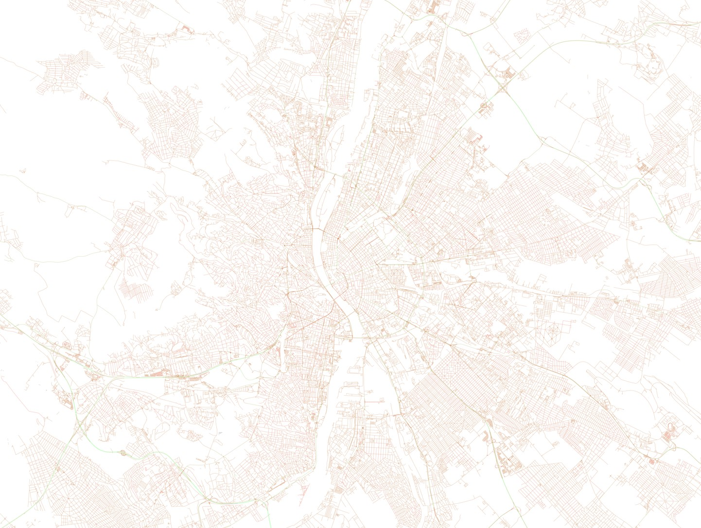
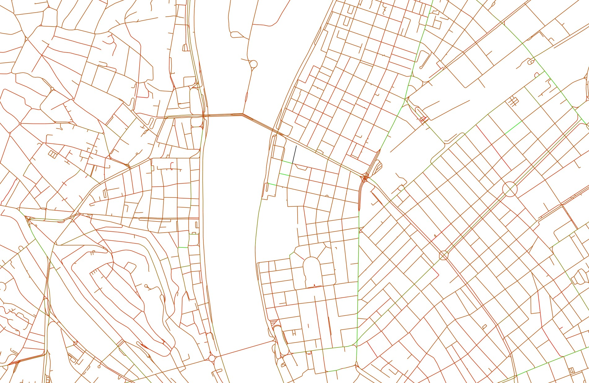

# Superblocks for Budapest

## Introduction

Superblocks are an urban planning approach that aims to improve the liveability and sustainability of cities. The concept involves creating areas bounded by arterial roads, with the local road network within the block serving only local needs. This reduces through traffic and allows for the redesign and alternative use of streets for pedestrians and cyclists, among other possibilities. The benefits of superblocks include reduced congestion and emissions, as well as opportunities for adapting cities to climate change.

This project aims to explore the potential for implementing superblocks in Budapest, a city known for its unique blend of history and modernity. By analyzing data and conducting simulations, we hope to gain insights into the feasibility and potential impacts of superblocks in Budapest.

## Objectives

The main objectives of this project are:

1. To understand the current traffic patterns and congestion levels in Budapest
2. To identify potential areas for implementing superblocks
3. To evaluate the potential benefits and trade-offs of superblocks in Budapest
4. To develop recommendations for policymakers and city planners on the feasibility and potential impacts of superblocks in Budapest

## Methodology

The project will involve the following steps:

1. Data collection and analysis: We will gather relevant data on traffic patterns, congestion levels, and other factors related to the implementation of superblocks in Budapest. This data will be cleaned, processed, and analyzed using appropriate statistical and computational methods.

2. Simulation and modeling: We will use traffic simulation software and other tools to model the impacts of superblocks on traffic flow, congestion, emissions, and other relevant variables.

3. Recommendations and conclusion: Based on the results of the data analysis and simulation, we will develop recommendations and conclusions on the feasibility and potential impacts of superblocks in Budapest. These recommendations will be presented in a report and disseminated to relevant stakeholders, including policymakers and city planners.


## Installation

To get started with this project, clone the repository and install the necessary dependencies:

```
git clone https://github.com/your-username/superblocks-budapest.git
cd superblocks-budapest
pip install -r requirements.txt
```

Once the dependencies are installed, you can begin exploring the data and implementing your own analyses.

## Status

This project is currently in the development phase. We welcome contributions and feedback from the community.

First screenshots of the capacity map:

 

[Download the full image (as zip)](assets/budapest.zip)

## Contributing

We welcome contributions to this project. If you have an idea for an analysis or improvement, please feel free to open an issue or create a pull request.

## License

This project is licensed under the terms of the [GNU General Public License v3.0](https://www.gnu.org/licenses/gpl-3.0.en.html). The cover image is licensed under the [Creative Commons Zero](https://creativecommons.org/publicdomain/zero/1.0/) license.
